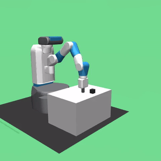

# Hindsight Experience Replay (HER) for Sparse-Reward Robotic Manipulation


A research implementation exploring how **Hindsight Experience Replay (HER)** combined with **Soft Actor-Critic (SAC)** solves sparse-reward robotic manipulation tasks that are intractable for standard off-policy reinforcement learning.

* **[Read the Full Technical Report](./HER_for_Robotic_Manipulation.pdf)**
* **[Interactive Training Curves (WandB)](https://wandb.ai/dev-r-carnegie-mellon-university/rl-fetch-push)**

## Project Overview
Training reinforcement learning agents on goal-conditioned tasks like robotic pushing is notoriously difficult due to **sparse rewards**. Standard off-policy algorithms fail because random exploration rarely achieves the goal, yielding no gradient signal. 

In this project, I implemented HER from scratch (using the "future" strategy with $k=4$) to relabel failed trajectories as "virtual successes." I evaluated this against a 7-DOF Fetch robot arm (`FetchPushFlat-v0`) using MuJoCo.

## Agent Behavior with and without HER

| Without HER (SAC Baseline) | With HER (SAC + HER) |
|:---:|:---:|
|  | </video> |
| *Fails to reach the target (6% success)* | *Successfully pushes object to target (96% success)* |

### Baseline vs. HER Performance
| Experiment | Success Rate | Mean Return |
|-----------|:------------:|:-----------:|
| SAC (no HER) | 6.0% | -47.00 |
| **SAC + HER (sparse)** | **96.0%** | **-15.64** |

## Experiments & Analysis

### 1. Algorithm Comparison: SAC vs. DDPG
Even with HER, algorithm choice is critical. DDPG proved completely incapable of solving the task. Its deterministic exploration via additive Gaussian noise caused severe policy divergence, with the arm moving off the table entirely. SAC's entropy-regularized, stochastic policy maintained stability.

| Metric | SAC + HER | DDPG + HER |
|--------|:---------:|:----------:|
| Success Rate | **96.0%** | 5.0% |
| Mean Return | **-15.64** | -47.42 |
| Mean Energy | **1.20** | 3.00 |

### 2. Reward Engineering: A Study in Reward Hacking
I hypothesized that dense rewards would accelerate training. I designed two custom rewards:
1. **Dense Energy:**
$$r = -||g^a - g^d||_2 - \lambda_e ||a_{1:3}||_2^2$$

2. **Approach Progress:**
$$r = -||p_{ee} - p_{obj}||_2 - ||g^a - g^d||_2 + \beta \Delta d_t$$

**Result:** Both failed completely (~6% success). 
**Insight:** This was caused by HER's relabeling mechanics. Because components like action penalties or gripper distances are not goal-recomputable, they became inconsistent between original and relabeled transitions. The agent exploited this by minimizing actions entirely (collapsing into paralysis) to avoid penalties rather than learning to push. 

### 3. Sim-to-Real: Zero-Shot Robustness vs. Domain Randomization
I evaluated the nominal SAC+HER policy against severe physical perturbations (mass, friction, and size variations). Surprisingly, the nominal policy generalized exceptionally well, outperforming a policy explicitly trained with Domain Randomization (DR). Training across all DR bounds from the start caused negative transfer, forcing the policy to hedge across conflicting physics regimes.

| Shift | Nominal-Trained Success | DR-Trained Success |
|:---:|:---:|:---:|
| **Baseline (1.0x)** | 96.0% | — |
| **Mass 0.5x** | 80.0% | 68.0% |
| **Mass 2.0x** | 100.0% | 92.0% |
| **Friction 2.0x**| 98.0% | 86.0% |
| **Size 0.8x** | 98.0% | 94.0% |

*(Full matrix available in the technical report).*

## Repository Structure & Implementation Details
* `/scripts/her_replay_buffer.py`: Core contribution. Designed to store full episodes (handling FIFO overflow) to ensure future states are sampled correctly. Relies on a decoupled `compute_reward_static` method for purely state-independent goal relabeling.
* `/scripts/sac_fetchpush.py` & `ddpg_fetchpush.py`: Training loops.
* `/scripts/fetch_push_env.py`: Environment wrappers and custom reward formulations.
* `/results`: JSON outputs of 100-episode evaluation runs for all variants.

### Environment & Reproducibility
* **Compute:** NVIDIA RTX 3060 6GB (~17 hours total compute across all experiments)
* **Stack:** Python 3.10, PyTorch 2.1.0, Gymnasium-Robotics 1.2.0

## How to Run
1. **Install dependencies:**
   ```bash
   pip install gymnasium[mujoco] gymnasium-robotics torch tyro wandb tensorboard